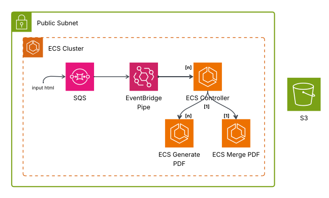

## Pdf Generator Microservice

A microservice high scalable to convert HTML into PDF.  

• The `SQS` receives a HTML as input.  
• `SQS` triggers `EventBridge Pipe` which then creates `ECS Controller`.  
• `ECS controller` manages the `ECS Generate PDF` and `ECS Merge PDF`.   
• `ECS controller` pulls `SQS` and creates `ECS Generate PDF` instances and wait them to finish the tasks.   
• The number of `ECS Generate` instances depends on the number of PDF pages.  
• `ECS Generate PDF` polls `SQS` messages and uses the HTML to generate PDF using puppetter browser chromium and then stores on `S3`.  
• Once all PDF pages are created `ECS Controller` creates the `ECS Merge PDF`.    
• `ECS Merge PDF` merges all pages into one final PDF.   

 

#### Instructions to build infrastructure
• create SQS sqs-page-queue  
• create task definition [see my-pdf-controller.md](ecs-task-controller/readme.md)  
• create task definition [see my-pdf-generate.md](ecs-task-pdf-generate/readme.md)  
• create task definition [see my-pdf-merge.md](ecs-task-pdf-merge/readme.md)  
• create eventbridge pipe [see event-bridge-pipe-sqs-ecs-controller.md](event-bridge-pipe-sqs-ecs-controller/readme.md)  
• init pdf generation with `send-html-sqs` microservice  
