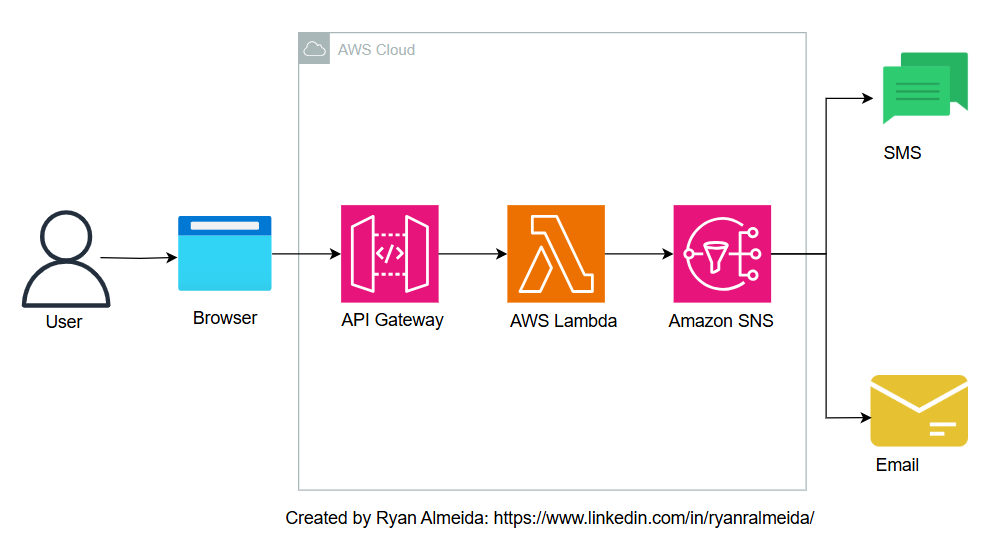
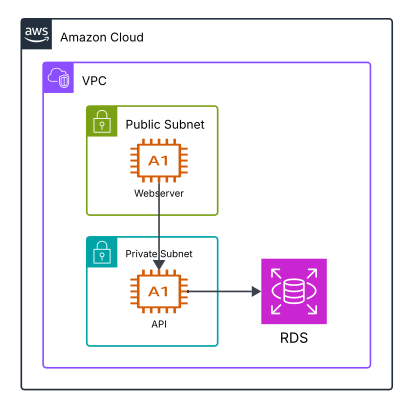

# AWS Labs

 

## Lambda message broadcast

The API Gateway exposes a POST endpoint to receive notification requests from lambda function that invokes a SNS.  
The SNS sends the message to 2 topics. (sms and email)  

[see lambda-send-sms-and-email.md](lambda-send-sms-and-email/readme.md)

 

## Two tier VPC

### Considerations
• Backend can only be ssh accessed via bastion host.  
• Backend allows frontend http requests on port 80.  
• Frontend and bastion host inside a public subnet and backend inside a private subnet.  
• Nginx redirects frontend requests to Api in a isolated URL.  
• Nginx allow https access to frontend on port 443.  
• IG allows public subnet to access internet.  
• NAT Gateway allows private subnet to access internet.  
• Api access DynamoDB via VPC endpoint.  

[see two-tier.md](two-tier/simple/readme.md)
