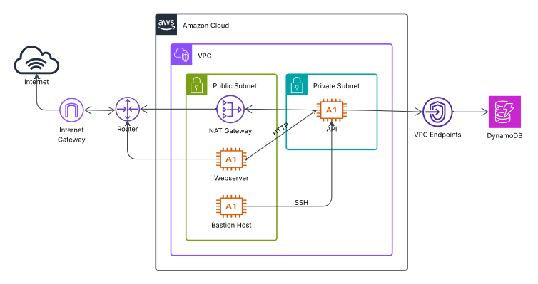

# Two tier VPC



## Considerations
• Backend can only be ssh accessed via bastion host.  
• Backend allows frontend http requests on port 80.  
• Frontend and bastion host inside a public subnet and backend inside a private subnet.  
• Nginx redirects frontend requests to Api in a isolated URL.  
• Nginx allow https access to frontend on port 443.  
• IG allows public subnet to access internet.  
• NAT Gateway allows private subnet to access internet.  
• Api access DynamoDB via VPC endpoint.  

<br />

## Setup
[1 - Config private network](1-private-network)  
[2 - First create public ec2 frontend](2-first-create-public-ec2-frontend)  
[3 - Config public ec2 SSL](3-config-public-ec2-ssl)  
[4 - Create bastion host ec2](4-bastion-host-ec2)  
[5 - Create private ec2](5-create-private-ec2)  
[6 - Config webserver request to api](6-config-webserver-request-to-api)  

<br />

## 1 - Config private network

- create a VPC
  - CIDR 10.0.0.0/16

- create public subnet
  - attach VPC
  - CIDR 10.0.0.0/24
  - auto assing public IP
  
- create a Internet Gateway
  - attach VPC

- create a public route table
  - attach VPC
  - asssociate public subnet
  - routes:
    - destination: 0.0.0.0/0; target: <internet_gateway>

- create a NAT Gateway
  - attach public subnet

- create a private route table
  - attach VPC
  - asssociate private subnet
  - routes:
    - destination: 0.0.0.0/0; target: <nat_gateway>

<br />

## 2 - First create public ec2 frontend

- create EC2 instance
  - name: frontend 
  - attach public subnet
  - auto assing public IP
  - attach secute group:
    - inbound rules:
      - type: HTTP; port: 80
      - type: HTTPS; port: 443
      - type: SSH; port: 22
  - user data: /webserver-user-data.sh

#### test connection ####
```bash
# access browser on url: <ec2_public_ip>  (should access)

#   (should access)
ssh -i <key> ec2-user@<ec2_public_ip>
```
####

<br />

## 3 - Config public ec2 SSL
create A host on noip with ipv4 <public_ec2_public_ip> with domain test-ec2.ddns.net

```bash
sudo yum install letsencrypt -y

# generate path to public and private key
# use a valid email
# noip host A with public ec2 ipv4
sudo certbot certonly --standalone -d test-ec2.ddns.net --email andreytsuzuki@gmail.com --agree-tos
```

instal nginx and config ssl:
```bash
sudo yum install nginx -y

# config nginx.conf
sudo cp /home/ec2-user/aws-labs/two-tier/simple/nginx-ssl.conf \
/etc/nginx/nginx.conf

sudo systemctl restart nginx
```

#### test public ec2 https request ####
on public ec2 `curl https://test-ec2.ddns.net`  
on browser `https://<public_ec2_public_ip>`  
####

<br />

## 4 - Create bastion host

- create a EC2 instance
  - name: BastionHost
  - VPC: DemoVPC
  - subnet: PublicSubnetA
  - Auto-assing public IP: Enable
  - create security group:
    - name: BastionSG
    - Inbound: ssh, protocol TCP, port 22

copy `key.pem` to ec2 bastion host.  
```bash
scp -i my-key.pem my-key.pem ec2-user@1<ec2_bastion_public_ip>:/home/ec2-user/
```

<br />

## 5 - Create private ec2

- create new role
  - name: DemoRoleEC2-DBReadOnly
  - policy: AmazonDynamoDBReadOnlyAccess

- create EC2 instance
  - name: app 
  - attach private subnet
  - attach secute group:
    - inbound rules:
      - type: SSH; port: 22; source: BastionSG
      - type: HTTP; port 80; source: PublicSG
  - attach role DemoRoleEC2-DBReadOnly

- create service endpoint
  - attach private route table
  - attach VPC
  - attach service dynamodb

<br />

#### test private ec2 access to dynamodb service ####

```bash
# connect to bastion host
ssh -i <key> ec2-user@<ec2_bastion_public_ip>
curl <ec2_private_ip>

# then from the bastion connect to private ec2:
ssh -i <key> ec2-user@<ec2_private_ip>

# should work
curl localhost:3000
aws ls dynamodb
```
####

<br />

## 6 - Config webserver request to api

```bash
# update index.html and nginx.conf
sudo cp /home/ec2-user/aws-labs/two-tier/simple/index.html \
/var/www/html/index.html

# adjust the private-ec2-ip
sudo cp /home/ec2-user/aws-labs/two-tier/simple/nginx \
/etc/nginx/nginx.conf

sudo nginx -t
sudo systemctl restart nginx
```

#### test request to api ####
```bash
# inside public ec2
curl https://test-ec2.ddns.net/api/items

# on browser load page
https://test-ec2.ddns.net
```
####
